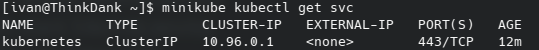

# Installing Minikube / Kubernetes

## Pre-requisite 
Install commands are for archlinux only

`pacman -S minikube libvirt qemu dnsmasq iptables-nft`

## Permission
`usermod -aG libvirt $(whoami)`
## Procedure
- `sudo systemctl enable libvirtd.service`
- `sudo systemctl start libvirtd.service`
- `minikube config set driver kvm2`
- `minikube start`

## Final
`minikube kubectl get svc` and there should be:

